# TransitFlow Analytics System - UML Diagrams

This document contains all PlantUML diagrams for the TransitFlow Analytics System.
Each diagram supports specific assignment requirements (P3, P4, M2).

## 📋 How to Use These Diagrams

1. **Copy the PlantUML code** from any section below
2. **Paste into PlantUML editor**: 
   - Online: https://www.plantuml.com/plantuml/uml/
   - VS Code: Install "PlantUML" extension
   - IntelliJ: Install "PlantUML integration" plugin
3. **Generate diagram** - The tool will render it automatically

## 📑 Table of Contents

1. [Use Case Diagram](#1-use-case-diagram) - ✅ Functional Requirements
2. [MVC Architecture Diagram](#2-mvc-architecture-diagram) - ✅ P3 Architecture
3. [Class Diagram](#3-class-diagram) - ✅ OOP Concepts, SOLID
4. [Factory Pattern Diagram](#4-factory-pattern-diagram) - ✅ M2 Design Patterns
5. [Strategy Pattern Diagram](#5-strategy-pattern-diagram) - ✅ M2 Design Patterns
6. [Adapter Pattern Diagram](#6-adapter-pattern-diagram) - ✅ M2 Design Patterns
7. [Facade Pattern Diagram](#7-facade-pattern-diagram) - ✅ M2 Design Patterns
8. [Activity Diagram](#8-activity-diagram-dataset-upload) - ✅ P3 Workflows
9. [Sequence Diagram - Dataset Upload](#9-sequence-diagram---dataset-upload) - ✅ P3
10. [Sequence Diagram - Analytics](#10-sequence-diagram---analytics-workflow) - ✅ P3
11. [Entity Relationship Diagram](#11-entity-relationship-diagram-erd) - ✅ Data Model
12. [Testing Architecture Diagram](#12-testing-architecture-diagram) - ✅ P4
13. [Automated Testing Workflow](#13-automated-testing-workflow-diagram) - ✅ P4
14. [Component Diagram](#14-component-diagram) - ⭐ Distinction Level
15. [Deployment Diagram](#15-deployment-diagram) - ⭐ Distinction Level

---

## 1. Use Case Diagram

**Purpose**: Shows how users interact with the system

**Assignment Mapping**: ✅ Functional Requirements, ✅ System Scope, ✅ User Interactions

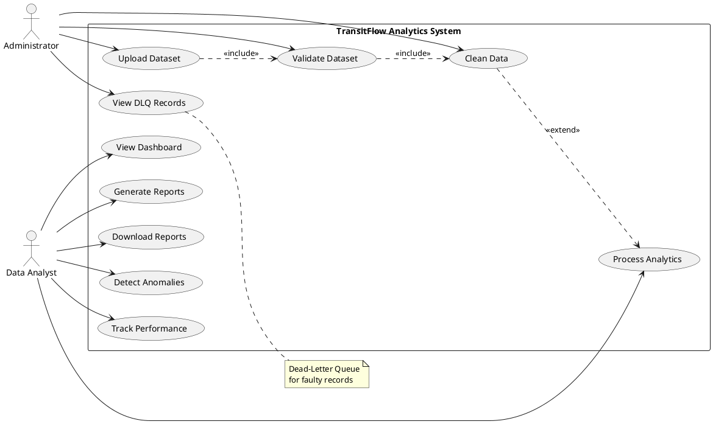

---

## 2. MVC Architecture Diagram

**Purpose**: Shows overall system architecture

**Assignment Mapping**: ✅ P3 Architecture Design, ✅ Clean Code Design

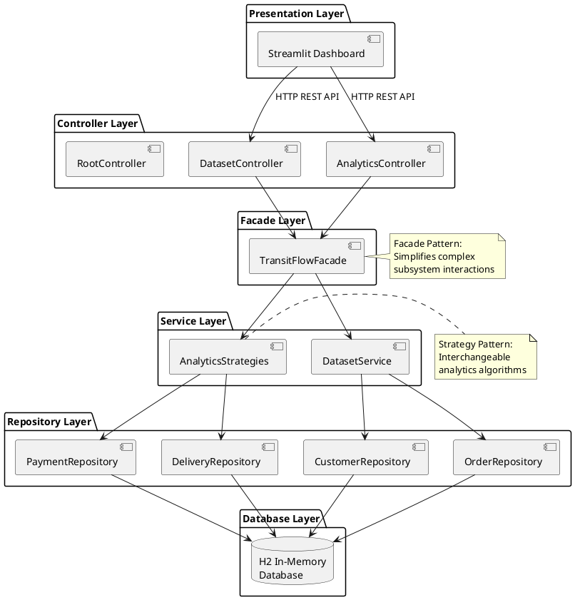

---

## 3. Complete Layer-by-Layer Class Diagram

**Purpose**: Shows comprehensive OOP Design across all system layers from bottom (Database) to top (Controllers)

**Assignment Mapping**: ✅ OOP Concepts, ✅ SOLID Principles, ✅ Low Level Design, ✅ Design Patterns

```plantuml
@startuml CompleteLayeredClassDiagram
!theme blueprint
scale 0.9

title TransitFlow Analytics System - Complete Layer-by-Layer Architecture\n(Bottom to Top: Database → Model → Repository → Service/Strategy → Facade → Controller)

' ========================================
' LAYER 1: DATABASE LAYER (BOTTOM)
' ========================================
package "LAYER 1: DATABASE" #1a1f2e {
  database "H2 In-Memory Database" as DB {
    storage "customers table" as tCustomers
    storage "orders table" as tOrders
    storage "order_items table" as tOrderItems
    storage "payments table" as tPayments
    storage "products table" as tProducts
    storage "sellers table" as tSellers
    storage "deliveries table" as tDeliveries
    storage "faulty_records table" as tFaulty
  }
}

' ========================================
' LAYER 2: MODEL LAYER (ENTITY/DOMAIN)
' ========================================
package "LAYER 2: MODEL (ENTITY/DOMAIN)" #1E2530 {
  
  class Customer {
    ' @Entity, @Table, @Data
    -String customerId
    -String customerUniqueId
    -String customerZipCodePrefix
    -String customerCity
    -String customerState
    +getCustomerId(): String
    +setCustomerId(String): void
    +getCustomerState(): String
  }
  
  class Order {
    ' @Entity, @Table, @Data
    -String orderId
    -String customerId
    -String orderStatus
    -LocalDateTime orderPurchaseTimestamp
    -LocalDateTime orderApprovedAt
    -LocalDateTime orderDeliveredCarrierDate
    -LocalDateTime orderDeliveredCustomerDate
    -LocalDateTime orderEstimatedDeliveryDate
    +getOrderId(): String
    +getCustomerId(): String
    +getOrderPurchaseTimestamp(): LocalDateTime
  }
  
  class OrderItem {
    ' @Entity, @Table, @Data
    -Long id
    -String orderId
    -String productId
    -String sellerId
    -Integer orderItemId
    -LocalDateTime shippingLimitDate
    -Double price
    -Double freightValue
    +getOrderId(): String
    +getPrice(): Double
  }
  
  class Payment {
    ' @Entity, @Table, @Data
    -Long id
    -String orderId
    -Integer paymentSequential
    -String paymentType
    -Integer paymentInstallments
    -Double paymentValue
    +getPaymentValue(): Double
    +getPaymentType(): String
  }
  
  class Product {
    ' @Entity, @Table, @Data
    -String productId
    -String productCategoryName
    -Integer productNameLength
    -Integer productDescriptionLength
    -Integer productPhotosQty
    -Integer productWeightG
    -Integer productLengthCm
    -Integer productHeightCm
    -Integer productWidthCm
    +getProductId(): String
    +getProductCategoryName(): String
  }
  
  class Seller {
    ' @Entity, @Table, @Data
    -String sellerId
    -String sellerZipCodePrefix
    -String sellerCity
    -String sellerState
    +getSellerId(): String
    +getSellerState(): String
  }
  
  class Delivery {
    ' @Entity, @Table, @Data
    -String orderId
    -String customerId
    -String orderStatus
    -LocalDateTime purchaseTimestamp
    -LocalDateTime deliveredTimestamp
    -LocalDateTime estimatedDelivery
    -Long transitTimeHours
    -Long delayHours
    -Boolean isDelayed
    +getTransitTimeHours(): Long
    +getIsDelayed(): Boolean
  }
  
  class FaultyRecord {
    ' @Entity, @Table, @Data
    -Long id
    -String sourceFile
    -String rawContent
    -String failureReason
    -LocalDateTime timestamp
    +getSourceFile(): String
  }
}

' ========================================
' LAYER 3: REPOSITORY LAYER (DATA ACCESS)
' ========================================
package "LAYER 3: REPOSITORY (DATA ACCESS)" #252d3d {
  
  interface CustomerRepository {
    {abstract} +findAll(): List<Customer>
    {abstract} +save(Customer): Customer
    {abstract} +count(): Long
    {abstract} +findByCustomerState(String): List<Customer>
    {abstract} +countByState(): List<Object[]>
    {abstract} +countByCity(): List<Object[]>
  }
  
  interface OrderRepository {
    {abstract} +findAll(): List<Order>
    {abstract} +save(Order): Order
    {abstract} +findByOrderStatus(String): List<Order>
    {abstract} +findByOrderPurchaseTimestampBetween(): List<Order>
    {abstract} +countByStatus(): List<Object[]>
    {abstract} +countByCustomerId(String): Long
    {abstract} +countOrdersByCustomer(): List<Object[]>
  }
  
  interface OrderItemRepository {
    {abstract} +findAll(): List<OrderItem>
    {abstract} +findByOrderId(String): List<OrderItem>
    {abstract} +getTopProducts(): List<Object[]>
  }
  
  interface PaymentRepository {
    {abstract} +findAll(): List<Payment>
    {abstract} +findByOrderId(String): List<Payment>
    {abstract} +aggregateByPaymentType(): List<Object[]>
    {abstract} +sumByOrderId(String): Double
    {abstract} +sumAllPayments(): Double
    {abstract} +sumRevenueByMonth(): List<Object[]>
  }
  
  interface ProductRepository {
    {abstract} +findAll(): List<Product>
    {abstract} +countByCategory(): List<Object[]>
  }
  
  interface SellerRepository {
    {abstract} +findAll(): List<Seller>
    {abstract} +findBySellerState(String): List<Seller>
    {abstract} +countByState(): List<Object[]>
  }
  
  interface DeliveryRepository {
    {abstract} +findAll(): List<Delivery>
    {abstract} +findByIsDelayed(Boolean): List<Delivery>
    {abstract} +getAverageTransitTime(): Double
    {abstract} +findDelayedDeliveries(): List<Delivery>
  }
  
  interface FaultyRecordRepository {
    {abstract} +findAll(): List<FaultyRecord>
    {abstract} +findBySourceFile(String): List<FaultyRecord>
    {abstract} +countBySourceFile(): List<Object[]>
  }
}

' ========================================
' LAYER 4A: ADAPTER & FACTORY LAYER
' ========================================
package "LAYER 4A: ADAPTER & FACTORY (DATA INGESTION)" #2d3548 {
  
  interface DatasetAdapter<T> {
    {abstract} +parseInChunks(int): List<List<T>>
    {abstract} +getTotalRecords(): long
  }
  
  class CsvDatasetAdapter<T> implements DatasetAdapter {
    -Path filePath
    -Function<CSVRecord,T> mapper
    -String sourceIdentifier
    +parseInChunks(int): List<List<T>>
    +getTotalRecords(): long
  }
  
  class DatasetLoaderFactory {
    {static} +createCustomerLoader(Path): DatasetAdapter<Customer>
    {static} +createOrderLoader(Path): DatasetAdapter<Order>
    {static} +createOrderItemLoader(Path): DatasetAdapter<OrderItem>
    {static} +createPaymentLoader(Path): DatasetAdapter<Payment>
    {static} +createProductLoader(Path): DatasetAdapter<Product>
    {static} +createSellerLoader(Path): DatasetAdapter<Seller>
    {static} -customerMapper(): Function<CSVRecord,Customer>
    {static} -orderMapper(): Function<CSVRecord,Order>
    {static} -parseTimestamp(String): LocalDateTime
    {static} -parseInteger(String): Integer
    {static} -parseDouble(String): Double
  }
}

' ========================================
' LAYER 4B: SERVICE LAYER
' ========================================
package "LAYER 4B: SERVICE (BUSINESS LOGIC)" #2d3548 {
  
  class DatasetService {
    {static} -int CHUNK_SIZE = 5000
    -CustomerRepository customerRepository
    -OrderRepository orderRepository
    -OrderItemRepository orderItemRepository
    -PaymentRepository paymentRepository
    -ProductRepository productRepository
    -SellerRepository sellerRepository
    -DeliveryRepository deliveryRepository
    -FaultyRecordRepository faultyRecordRepository
    +ingestFromDirectory(String): Map<String,Object>
    +getIngestionStats(): Map<String,Object>
    -processCustomers(Path, Map): void
    -processOrders(Path, Map): void
    -processOrderItems(Path, Map): void
    -processPayments(Path, Map): void
    -processProducts(Path, Map): void
    -processSellers(Path, Map): void
    -generateDeliveryMetrics(): void
    -findFile(Path, String): Path
    -isValidCustomer(Customer): boolean
    -isValidOrder(Order): boolean
  }
}

' ========================================
' LAYER 4C: STRATEGY LAYER
' ========================================
package "LAYER 4C: STRATEGY (ANALYTICS ALGORITHMS)" #2d3548 {
  
  interface AnalyticsStrategy {
    {abstract} +execute(): Map<String,Object>
    {abstract} +getStrategyName(): String
  }
  
  class PeakDeliveryStrategy implements AnalyticsStrategy {
    -OrderRepository orderRepository
    +execute(): Map<String,Object>
    +getStrategyName(): String
    -analyzeHourlyPeaks(): Map
    -analyzeDailyPeaks(): Map
    -analyzeDayOfWeek(): Map
  }
  
  class CustomerSegmentationStrategy implements AnalyticsStrategy {
    -CustomerRepository customerRepository
    -OrderRepository orderRepository
    -PaymentRepository paymentRepository
    +execute(): Map<String,Object>
    +getStrategyName(): String
    -segmentByGeography(): Map
    -segmentByFrequency(): Map
  }
  
  class DeliveryEfficiencyStrategy implements AnalyticsStrategy {
    -DeliveryRepository deliveryRepository
    +execute(): Map<String,Object>
    +getStrategyName(): String
    -calculateAverageTransitTime(): Double
    -calculateDelayRate(): Double
  }
  
  class RevenueAnalysisStrategy implements AnalyticsStrategy {
    -PaymentRepository paymentRepository
    -OrderRepository orderRepository
    +execute(): Map<String,Object>
    +getStrategyName(): String
    -calculateTotalRevenue(): Double
    -analyzeMonthlyTrends(): List
    -analyzePaymentTypes(): Map
  }
  
  class AnomalyDetectionStrategy implements AnalyticsStrategy {
    -PaymentRepository paymentRepository
    -DeliveryRepository deliveryRepository
    +execute(): Map<String,Object>
    +getStrategyName(): String
    -detectPriceAnomalies(): List
    -detectDelayAnomalies(): List
    -calculateStdDev(List, double): double
  }
  
  class SeasonalDemandStrategy implements AnalyticsStrategy {
    -OrderRepository orderRepository
    +execute(): Map<String,Object>
    +getStrategyName(): String
    -calculateMonthlyOrders(): Map
    -calculateMonthlyGrowth(): Map
    -analyzeHolidayPeriods(): Map
    -analyzeSeasonalPatterns(): Map
    -analyzeQuarterlyTrends(): Map
  }
  
  class RegionalPerformanceStrategy implements AnalyticsStrategy {
    -CustomerRepository customerRepository
    -OrderRepository orderRepository
    -DeliveryRepository deliveryRepository
    -PaymentRepository paymentRepository
    -SellerRepository sellerRepository
    +execute(): Map<String,Object>
    +getStrategyName(): String
    -calculateCustomersByRegion(): Map
    -calculateOrdersByRegion(): Map
    -calculateRevenueByRegion(): Map
    -calculateDeliveryPerformance(): Map
    -generateRegionalRankings(): List
  }
}

' ========================================
' LAYER 5: FACADE LAYER
' ========================================
package "LAYER 5: FACADE (UNIFIED INTERFACE)" #3d4758 {
  
  class TransitFlowFacade {
    -DatasetService datasetService
    -PeakDeliveryStrategy peakDeliveryStrategy
    -CustomerSegmentationStrategy customerSegmentationStrategy
    -DeliveryEfficiencyStrategy deliveryEfficiencyStrategy
    -RevenueAnalysisStrategy revenueAnalysisStrategy
    -AnomalyDetectionStrategy anomalyDetectionStrategy
    -SeasonalDemandStrategy seasonalDemandStrategy
    -RegionalPerformanceStrategy regionalPerformanceStrategy
    +ingestDatasets(String): Map<String,Object>
    +getIngestionStats(): Map<String,Object>
    +executeAnalysis(String): Map<String,Object>
  }
}

' ========================================
' LAYER 6: CONTROLLER LAYER (TOP)
' ========================================
package "LAYER 6: CONTROLLER (REST API)" #4d5768 {
  
  class DatasetController {
    -TransitFlowFacade facade
    +ingestDataset(Map): ResponseEntity<Map>
    +getStats(): ResponseEntity<Map>
  }
  
  class AnalyticsController {
    -TransitFlowFacade facade
    +getPeakDelivery(): ResponseEntity<Map>
    +getCustomerSegmentation(): ResponseEntity<Map>
    +getDeliveryEfficiency(): ResponseEntity<Map>
    +getRevenueAnalysis(): ResponseEntity<Map>
    +getAnomalyDetection(): ResponseEntity<Map>
    +getSeasonalDemand(): ResponseEntity<Map>
    +getRegionalPerformance(): ResponseEntity<Map>
  }
  
  class RootController {
    +welcome(): String
  }
}

' ========================================
' LAYER 7: CONFIGURATION LAYER
' ========================================
package "LAYER 7: CONFIGURATION" #5d6778 {
  
  class WebConfig {
    +addCorsMappings(CorsRegistry): void
  }
}

' ========================================
' RELATIONSHIPS - LAYER BY LAYER
' ========================================

' Model → Database
Customer ..> tCustomers : maps to
Order ..> tOrders : maps to
OrderItem ..> tOrderItems : maps to
Payment ..> tPayments : maps to
Product ..> tProducts : maps to
Seller ..> tSellers : maps to
Delivery ..> tDeliveries : maps to
FaultyRecord ..> tFaulty : maps to

' Domain Model Relationships
Customer "1" --> "0..*" Order : places
Order "1" --> "1..*" OrderItem : contains
Order "1" --> "1..*" Payment : paid by
Order "1" --> "0..1" Delivery : tracked as
Product "1" --> "0..*" OrderItem : ordered as
Seller "1" --> "0..*" OrderItem : sells

' Repository → Model
CustomerRepository ..> Customer : manages
OrderRepository ..> Order : manages
OrderItemRepository ..> OrderItem : manages
PaymentRepository ..> Payment : manages
ProductRepository ..> Product : manages
SellerRepository ..> Seller : manages
DeliveryRepository ..> Delivery : manages
FaultyRecordRepository ..> FaultyRecord : manages

' Repository → Database
CustomerRepository ..> DB
OrderRepository ..> DB
OrderItemRepository ..> DB
PaymentRepository ..> DB
ProductRepository ..> DB
SellerRepository ..> DB
DeliveryRepository ..> DB
FaultyRecordRepository ..> DB

' Adapter/Factory → Model
DatasetAdapter ..> Customer : creates
DatasetAdapter ..> Order : creates
DatasetAdapter ..> Payment : creates
DatasetLoaderFactory ..> CsvDatasetAdapter : creates
DatasetLoaderFactory ..> Customer : maps to
DatasetLoaderFactory ..> Order : maps to
DatasetLoaderFactory ..> OrderItem : maps to
DatasetLoaderFactory ..> Payment : maps to
DatasetLoaderFactory ..> Product : maps to
DatasetLoaderFactory ..> Seller : maps to

' Service → Repository
DatasetService --> CustomerRepository : uses
DatasetService --> OrderRepository : uses
DatasetService --> OrderItemRepository : uses
DatasetService --> PaymentRepository : uses
DatasetService --> ProductRepository : uses
DatasetService --> SellerRepository : uses
DatasetService --> DeliveryRepository : uses
DatasetService --> FaultyRecordRepository : uses
DatasetService --> DatasetLoaderFactory : uses
DatasetService --> CsvDatasetAdapter : uses

' Strategy → Repository
PeakDeliveryStrategy --> OrderRepository : queries
CustomerSegmentationStrategy --> CustomerRepository : queries
CustomerSegmentationStrategy --> OrderRepository : queries
CustomerSegmentationStrategy --> PaymentRepository : queries
DeliveryEfficiencyStrategy --> DeliveryRepository : queries
RevenueAnalysisStrategy --> PaymentRepository : queries
RevenueAnalysisStrategy --> OrderRepository : queries
AnomalyDetectionStrategy --> PaymentRepository : queries
AnomalyDetectionStrategy --> DeliveryRepository : queries
SeasonalDemandStrategy --> OrderRepository : queries
RegionalPerformanceStrategy --> CustomerRepository : queries
RegionalPerformanceStrategy --> OrderRepository : queries
RegionalPerformanceStrategy --> DeliveryRepository : queries
RegionalPerformanceStrategy --> PaymentRepository : queries
RegionalPerformanceStrategy --> SellerRepository : queries

' Facade → Service & Strategy
TransitFlowFacade --> DatasetService : delegates
TransitFlowFacade --> PeakDeliveryStrategy : executes
TransitFlowFacade --> CustomerSegmentationStrategy : executes
TransitFlowFacade --> DeliveryEfficiencyStrategy : executes
TransitFlowFacade --> RevenueAnalysisStrategy : executes
TransitFlowFacade --> AnomalyDetectionStrategy : executes
TransitFlowFacade --> SeasonalDemandStrategy : executes
TransitFlowFacade --> RegionalPerformanceStrategy : executes

' Controller → Facade
DatasetController --> TransitFlowFacade : uses
AnalyticsController --> TransitFlowFacade : uses

' Design Pattern Annotations
note right of DatasetAdapter
  Adapter Pattern:
  Converts CSV format
  to entity objects
end note

note right of DatasetLoaderFactory
  Factory Pattern:
  Creates appropriate
  adapter instances
end note

note right of AnalyticsStrategy
  Strategy Pattern:
  Interchangeable
  analytics algorithms
end note

note right of TransitFlowFacade
  Facade Pattern:
  Simplifies complex
  subsystem interactions
end note

note right of CustomerRepository
  Repository Pattern:
  Abstracts data
  access layer
end note

@enduml
```

---

## 4. Factory Pattern Diagram

**Purpose**: Shows how Factory creates appropriate adapters based on file type

**Assignment Mapping**: ✅ M2 Design Pattern Evidence, ✅ SOLID Principles

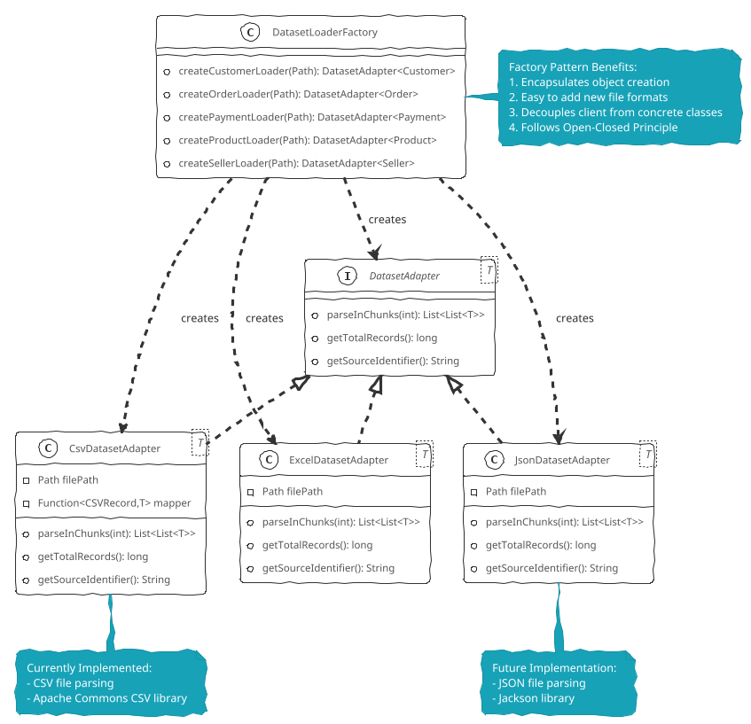

---

## 5. Strategy Pattern Diagram

**Purpose**: Shows interchangeable analytics algorithms

**Assignment Mapping**: ✅ M2 Design Pattern Evidence, ✅ SOLID Principles

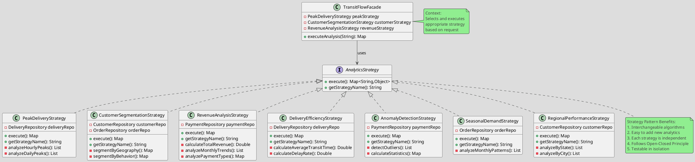

---

## 6. Adapter Pattern Diagram

**Purpose**: Converts different file formats into standardized entity objects

**Assignment Mapping**: ✅ M2 Design Pattern Evidence

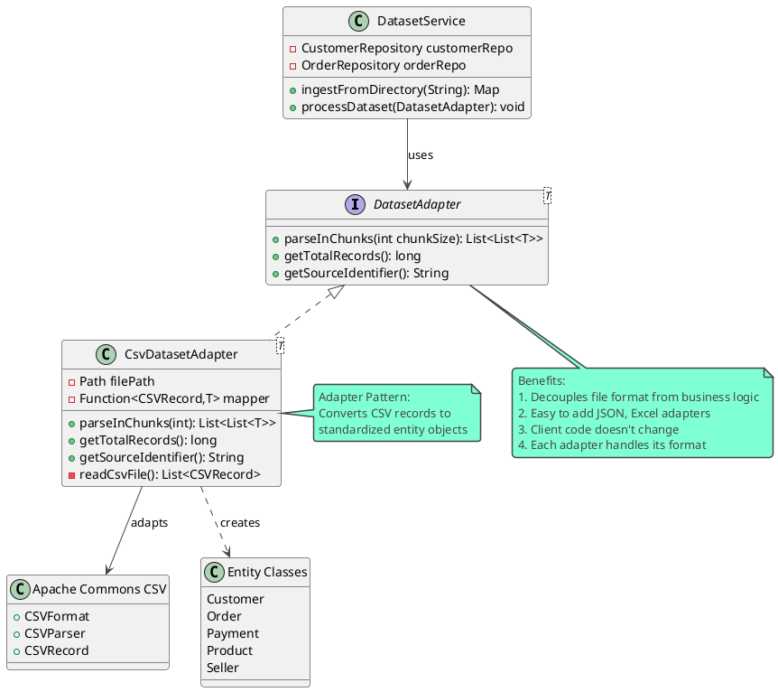

---

## 7. Facade Pattern Diagram

**Purpose**: Simplifies complex subsystem interactions for controllers

**Assignment Mapping**: ✅ M2 Design Pattern Evidence

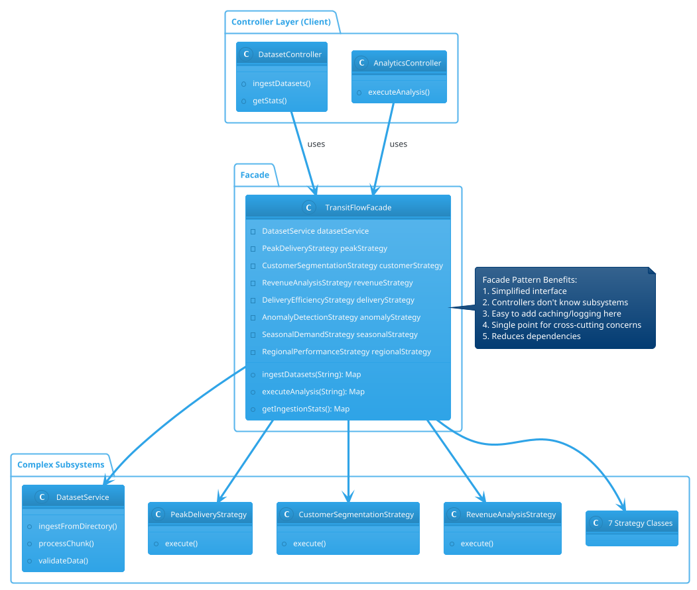

---

## 8. Activity Diagram (Dataset Upload Process)

**Purpose**: Shows workflow for dataset ingestion process

**Assignment Mapping**: ✅ P3 Process Flow

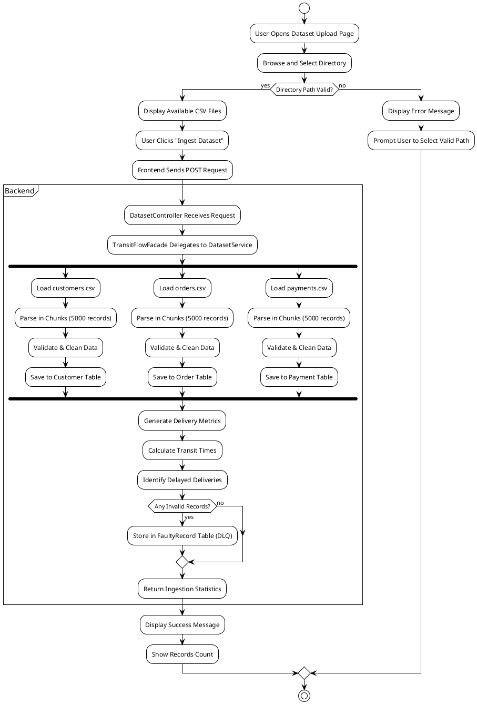

---

## 9. Sequence Diagram - Dataset Upload

**Purpose**: Shows detailed interaction between components during dataset ingestion

**Assignment Mapping**: ✅ P3 Component Interaction

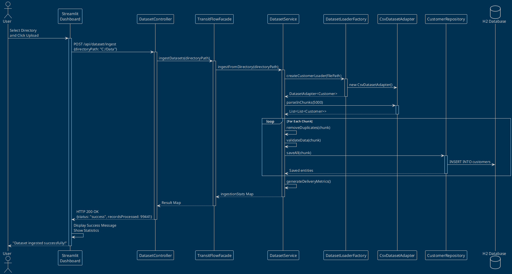

---

## 10. Sequence Diagram - Analytics Workflow

**Purpose**: Shows how analytics requests are processed using Strategy Pattern

**Assignment Mapping**: ✅ P3 Component Interaction, ✅ M2 Design Patterns

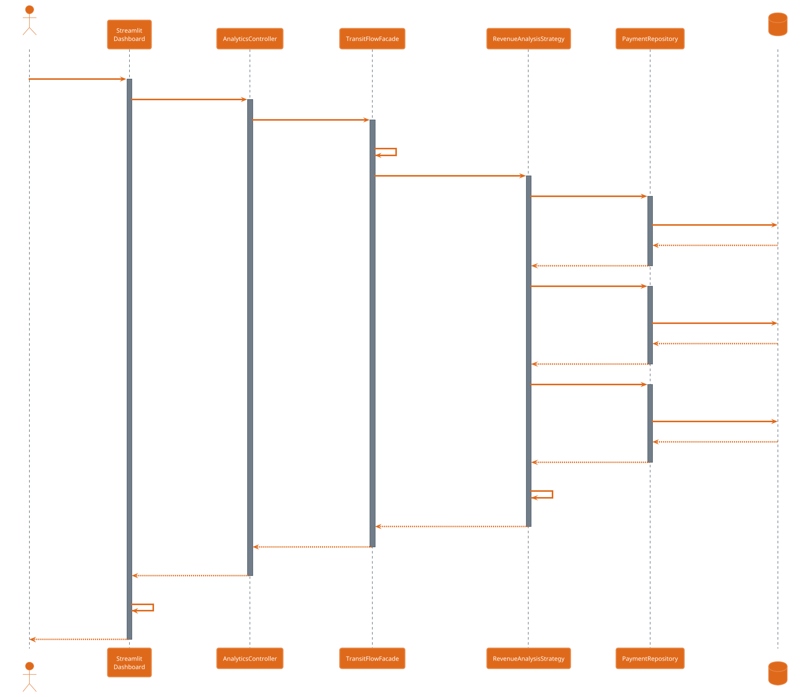

---

## 11. Entity Relationship Diagram (ERD)

**Purpose**: Shows database schema and relationships

**Assignment Mapping**: ✅ Large Dataset Design, ✅ Data Model Design

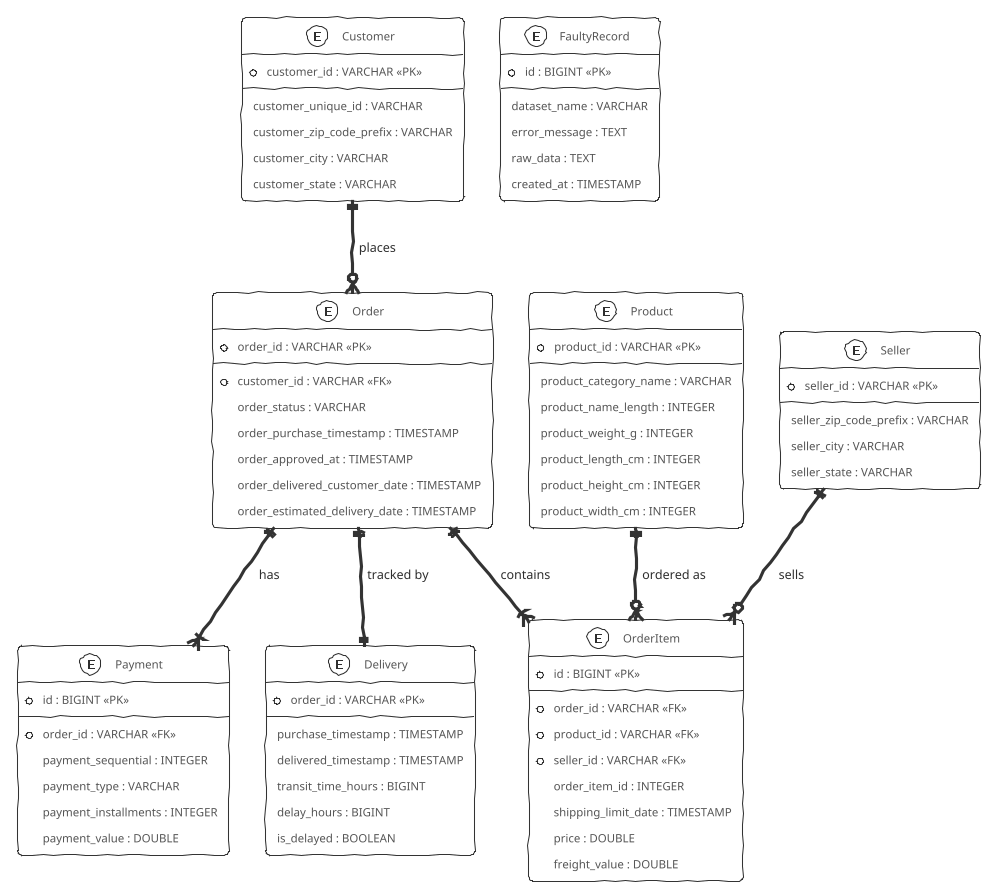

---

## 12. Testing Architecture Diagram

**Purpose**: Shows testing structure for the system

**Assignment Mapping**: ✅ P4 Testing Strategy

```plantuml
@startuml TestingArchitecture
!theme cerulean-outline

package "Backend Testing (Java)" {
  package "Unit Tests" {
    [RepositoryTests] as UT1
    [ServiceTests] as UT2
    [StrategyTests] as UT3
    [ControllerTests] as UT4
  }
  
  package "Integration Tests" {
    [API Integration Tests] as IT1
    [Database Integration Tests] as IT2
  }
  
  [JUnit 5] as JUnit
  [Mockito] as Mockito
  [Spring Test] as SpringTest
}

package "Frontend Testing (Python)" {
  package "Unit Tests" {
    [Page Tests] as PT1
    [Utility Tests] as PT2
  }
  
  package "Integration Tests" {
    [API Integration Tests] as PT3
  }
  
  [PyTest] as PyTest
  [Requests Library] as Requests
}

package "End-to-End Testing" {
  [Selenium WebDriver] as Selenium
  [UI Automation Tests] as E2E
}

package "Application Under Test" {
  [Spring Boot Backend] as Backend
  [Streamlit Frontend] as Frontend
  database "H2 Database" as DB
}

UT1 --> JUnit
UT2 --> JUnit
UT2 --> Mockito
UT3 --> JUnit
UT4 --> SpringTest

IT1 --> SpringTest
IT2 --> SpringTest

PT1 --> PyTest
PT2 --> PyTest
PT3 --> PyTest
PT3 --> Requests

E2E --> Selenium

IT1 --> Backend
IT2 --> DB
PT3 --> Backend
E2E --> Frontend
E2E --> Backend

note right of JUnit
  Testing Framework:
  - JUnit 5 (Jupiter)
  - @Test annotations
  - Assertions
end note

note right of PyTest
  Python Testing:
  - pytest framework
  - fixtures
  - parameterized tests
end note

note bottom of E2E
  Full User Journey:
  1. Upload dataset
  2. Navigate pages
  3. View analytics
  4. Generate reports
end note

@enduml
```

---

## 13. Automated Testing Workflow Diagram

**Purpose**: Shows CI/CD testing automation workflow

**Assignment Mapping**: ✅ P4 Automated Testing

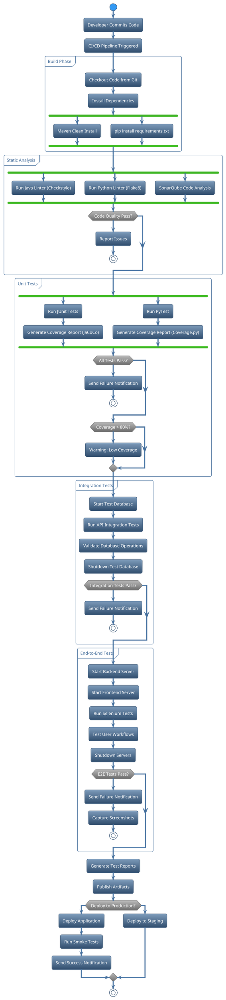

---

## 14. Component Diagram

**Purpose**: Shows major system components and their dependencies

**Assignment Mapping**: ⭐⭐ Distinction Level - System Architecture

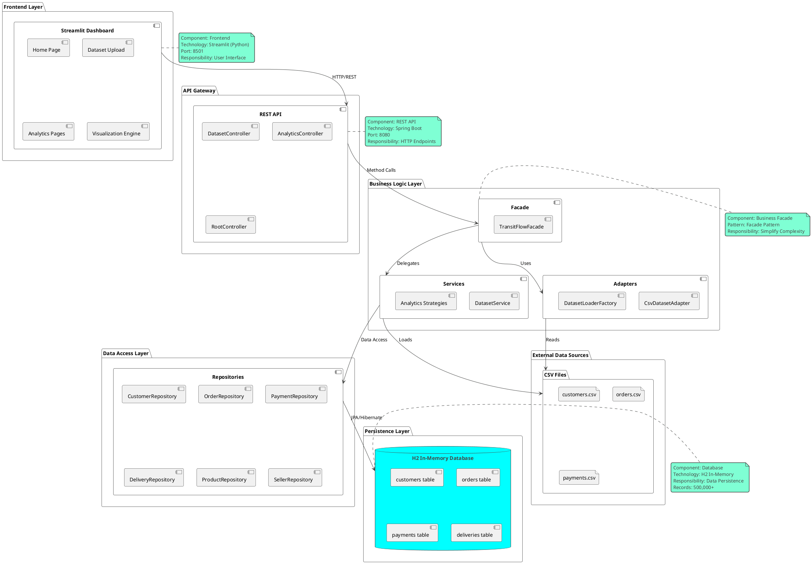

---

## 15. Deployment Diagram

**Purpose**: Shows physical deployment architecture

**Assignment Mapping**: ⭐⭐ Distinction Level - Deployment Architecture

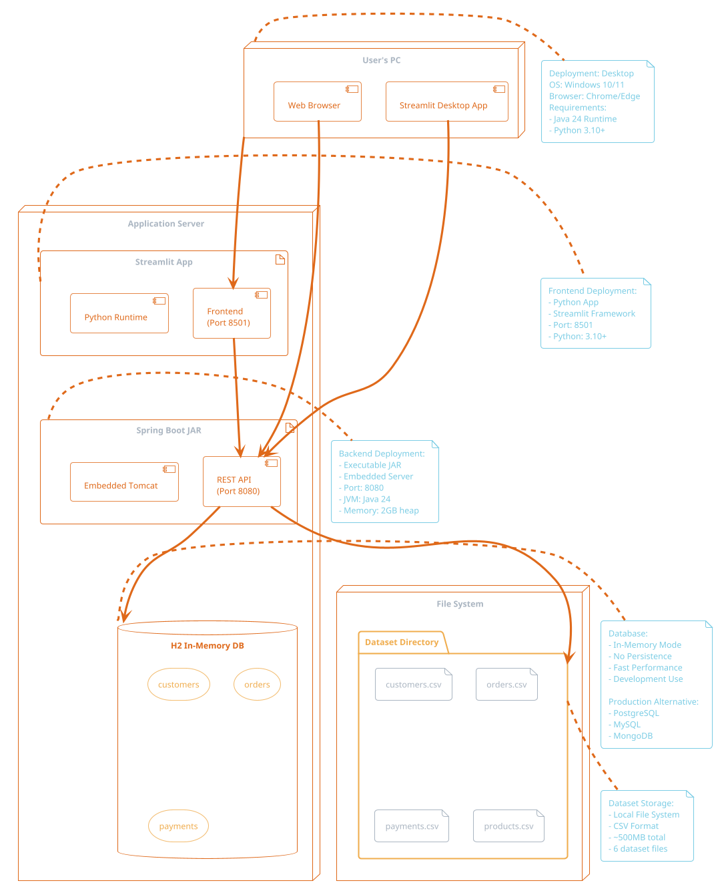

---

## 📊 Diagram Summary

### Assignment Coverage Map

| Diagram # | Diagram Name | P3 | P4 | M2 | Distinction |
|-----------|-------------|----|----|-------|-------------|
| 1 | Use Case Diagram | ✅ | - | - | - |
| 2 | MVC Architecture | ✅ | - | - | - |
| 3 | Class Diagram | ✅ | - | ✅ | - |
| 4 | Factory Pattern | - | - | ✅ | - |
| 5 | Strategy Pattern | - | - | ✅ | - |
| 6 | Adapter Pattern | - | - | ✅ | - |
| 7 | Facade Pattern | - | - | ✅ | - |
| 8 | Activity Diagram | ✅ | - | - | - |
| 9 | Sequence (Upload) | ✅ | - | - | - |
| 10 | Sequence (Analytics) | ✅ | - | ✅ | - |
| 11 | ERD | ✅ | - | - | - |
| 12 | Testing Architecture | - | ✅ | - | - |
| 13 | Testing Workflow | - | ✅ | - | - |
| 14 | Component Diagram | ✅ | - | - | ⭐⭐ |
| 15 | Deployment Diagram | ✅ | - | - | ⭐⭐ |

### Key Points for Assignment Submission

#### **P3 (Design)** - 9 Diagrams
- Use Case: Shows functional requirements
- MVC Architecture: Overall system design
- Class Diagram: OOP implementation
- Activity: Process workflows
- 2 Sequence Diagrams: Component interactions
- ERD: Database design
- Component & Deployment: System architecture

#### **P4 (Testing)** - 2 Diagrams
- Testing Architecture: Testing structure
- Testing Workflow: Automated testing process

#### **M2 (Design Patterns)** - 5 Diagrams
- Factory Pattern: Object creation
- Strategy Pattern: Interchangeable algorithms
- Adapter Pattern: Format conversion
- Facade Pattern: Simplified interface
- Class Diagram: Shows SOLID principles

#### **Distinction Level** - 2 Diagrams
- Component Diagram: Advanced architecture
- Deployment Diagram: Infrastructure design

---

## 🎯 Design Patterns Explained

### 1. **Factory Pattern** (DatasetLoaderFactory)
**Purpose**: Creates appropriate adapter based on file type (CSV, JSON, Excel)

**Benefits**:
- Encapsulates object creation logic
- Easy to add new file formats
- Client code doesn't need to know concrete classes

**Example**:
```java
DatasetAdapter<Customer> adapter = DatasetLoaderFactory.createCustomerLoader(filePath);
// Factory decides: CSV → CsvDatasetAdapter, JSON → JsonDatasetAdapter
```

---

### 2. **Strategy Pattern** (AnalyticsStrategy)
**Purpose**: Encapsulates interchangeable analytics algorithms

**Benefits**:
- Each strategy is independent and testable
- Easy to add new analytics without modifying existing code
- Algorithms can be selected dynamically at runtime

**Implementations**:
- PeakDeliveryStrategy
- CustomerSegmentationStrategy
- RevenueAnalysisStrategy
- DeliveryEfficiencyStrategy
- AnomalyDetectionStrategy
- SeasonalDemandStrategy
- RegionalPerformanceStrategy

---

### 3. **Adapter Pattern** (DatasetAdapter)
**Purpose**: Converts different file formats into standardized entity objects

**Benefits**:
- Decouples data source from business logic
- Each adapter handles format-specific parsing
- Easy to support multiple formats

**Flow**:
```
CSV File → CsvDatasetAdapter → Customer Entity → Repository → Database
JSON File → JsonDatasetAdapter → Customer Entity → Repository → Database
```

---

### 4. **Facade Pattern** (TransitFlowFacade)
**Purpose**: Provides simplified interface to complex subsystems

**Benefits**:
- Controllers call one simple method instead of managing multiple services
- Hides complexity of service/strategy coordination
- Single point for cross-cutting concerns (logging, caching)

**Example**:
```java
// Without Facade (Complex)
DatasetService service = new DatasetService();
service.loadCustomers();
service.loadOrders();
service.validateData();
service.processMetrics();

// With Facade (Simple)
facade.ingestDatasets(directoryPath);
```

---

## 🛠️ How to Generate Diagrams

### Method 1: Online PlantUML Editor (Easiest)
1. Visit: https://www.plantuml.com/plantuml/uml/
2. Copy any diagram code from this file
3. Paste into the editor
4. Click "Submit" to generate
5. Download as PNG/SVG

### Method 2: VS Code Extension
1. Install "PlantUML" extension by jebbs
2. Open this DIAGRAMS.md file
3. Press `Alt+D` to preview any diagram
4. Right-click diagram → Export to PNG/SVG

### Method 3: IntelliJ IDEA Plugin
1. Install "PlantUML integration" plugin
2. Open this file in IntelliJ
3. Right-click code block → Show PlantUML Diagram
4. Export as needed

### Method 4: Command Line
```bash
# Install PlantUML
npm install -g node-plantuml

# Generate diagram
puml generate diagram.puml -o output.png
```

---

## 📖 PlantUML Resources

- **Official Website**: https://plantuml.com/
- **Language Reference**: https://plantuml.com/guide
- **Theme Gallery**: https://the-lum.github.io/puml-themes-gallery/
- **Real World Examples**: https://real-world-plantuml.com/

---

## 📝 Tips for Assignment Submission

### For P3 (Design Document):
1. Include diagrams 1, 2, 3, 8, 9, 10, 11, 14, 15
2. Explain each diagram in your document
3. Show how design supports requirements
4. Reference ARCHITECTURE.md for context

### For M2 (Design Patterns Refinement):
1. Include diagrams 4, 5, 6, 7
2. Explain each pattern's benefits
3. Show code examples from your system
4. Demonstrate SOLID principles

### For P4 (Testing Strategy):
1. Include diagrams 12, 13
2. Explain testing levels (unit, integration, E2E)
3. Show test coverage reports
4. Document automated testing setup

### For Distinction:
1. Include all 15 diagrams
2. Add component and deployment diagrams
3. Show scalability considerations
4. Document performance optimizations

---

## ✅ Quality Checklist

Before submitting, ensure:
- [ ] All 15 diagrams render correctly
- [ ] Diagrams match your actual code
- [ ] Labels are clear and readable
- [ ] Relationships are accurate
- [ ] Patterns are correctly implemented
- [ ] Assignment requirements are mapped
- [ ] Diagrams support your documentation

---

**Document Version**: 1.0.0  
**Last Updated**: 2026-06-03  
**Author**: TransitFlow Development Team  
**Purpose**: Academic Assignment (P3, P4, M2)

